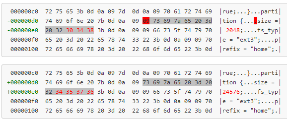

# Nokia n900 reference install

## Contents

* [Prerequisites](#prerequisites)
    * [Flashers](#flashers)
    * [Firmware images](#firmware-images)
* [Firmware modifications](#firmware-modifications)
    * [eMMC](#emmc)
    * [rootfs](#rootfs)

## Prerequisites

### Flashers
* Nokia official [flasher-3.5] (https://wiki.maemo.org/Documentation/Maemo_5_Developer_Guide/Development_Environment/Maemo_Flasher-3.5)
* [0xFFFF] (https://talk.maemo.org/showthread.php?t=87996)

Running Nokia flasher-3.5 `i386` binary on `x86_64`  Debian:

    # uname -a
    Linux base 3.16.0-4-amd64 #1 SMP Debian 3.16.7-ckt20-1+deb8u3 (2016-01-17) x86_64 GNU/Linux
    
    # ./flasher-3.5-i386
    -bash: ./flasher-3.5-i386: No such file or directory
    
    # apt-get install libc6-i386
    
    # ./flasher-3.5-i386
    ./flasher-3.5-i386: error while loading shared libraries: libusb-0.1.so.4:
                    cannot open shared object file: No such file or directory
    
    # ldd flasher-3.5-i386
            linux-gate.so.1 (0xf7702000)
            libusb-0.1.so.4 => not found
            libc.so.6 => /lib32/libc.so.6 (0xf7548000)
            /lib/ld-linux.so.2 (0xf7705000)
    
    # dpkg --add-architecture i386
    # apt-get update
    # apt-get install libusb-0.1-4:i386

### Firmware images
* eMMC aka VANILLA (latest: `RX-51_2009SE_10.2010.13-2.VANILLA_PR_EMMC_MR0_ARM.bin`)
* FIASCO aka COMBINED aka rootfs (latest: `RX-51_2009SE_21.2011.38-1_PR_COMBINED_MR0_ARM.bin` )

MD5:

    488809ff96a0a05479d692e9f77aeb4f  RX-51_2009SE_10.2010.13-2.VANILLA_PR_EMMC_MR0_ARM.bin
    095259c2380e894dc1d6a2999526ec9f  RX-51_2009SE_21.2011.38-1_PR_COMBINED_MR0_ARM.bin

## Firmware modifications

### eMMC

Edit VANILLA image starting at 0xcb. Make sure it says:

    partition {size = 2048; fs_type = "ext3"; prefix = "home";}

Stealing whitespace like described [here](http://wiki.maemo.org/User:Joerg_rw/tools#increase_size_of_.2Fhome_-_if_you_like_that) overcomes '9999' limit described [here](http://wiki.maemo.org/Repartitioning_the_flash#Solution_.235:_Edit_eMMC_image_.28works_on_PR1.2.2C_by_globalbus.29). You can do it in Hex etitor (like hte), or simply with sed:

    $ sed -e "s/.size = 2048/size = 24576/" RX-51_2009SE_10.2010.13-2.VANILLA_PR_EMMC_MR0_ARM.bin  > mod-RX-51_2009SE_10.2010.13-2.VANILLA_PR_EMMC_MR0_ARM.bin

Resulting in:

Modification increases /home patrition from 2G to 24G, leaving 5.1G to VFAT MyDocs.

### rootfs

Rootfs is included in COMBINED/FIASCO image, and first must be extracted.

with flasher-3.5:

    $ ./flasher-3.5 -F RX-51_2009SE_21.2011.38-1_PR_COMBINED_MR0_ARM.bin --unpack=dump/
    <...> 
    Unpacking rootfs image to file 'dump/rootfs.jffs2'...
    <...>

or with 0xFFFF:

    $ ./flasher-0xFFFF -M RX-51_2009SE_21.2011.38-1_PR_COMBINED_MR0_ARM.bin -u dump/
    <...>
    Output file: rootfs_RX-51_2009SE_21.2011.38-1_PR_MR0
    <...>

we are going to follow latter naming convention.

Rootfs image is an [UBI](http://www.linux-mtd.infradead.org/doc/ubi.html) image. Creating modified rootfs image involves several steps.

Install mtd-utils if not installed:

    $ sudo apt-get install mtd-utils

Follow instructions [courtesy of Pali](https://talk.maemo.org/showpost.php?p=1325044&postcount=13):

 1. Load nandsim module (which emulate nand mtd device) with same layout as has N900:

    $ modprobe nandsim first_id_byte=0x20 second_id_byte=0xaa third_id_byte=0x00 fourth_id_byte=0x15 parts=1,3,2,16,16,2010
    
 2. Load ubi and ubifs modules:

    $ modprobe ubi
    $ modprobe ubifs

 3. Flash rootfs ubi image to emulated nand mtd device:

    $ ubiformat /dev/mtd5 -s 512 -O 512 -f <rootfs_image>

 4. Attach mtd device to ubi:

   $ ubiattach /dev/ubi_ctrl -p /dev/mtd5

 5. Mount rootfs volume (ubifs image) from ubi to /mnt/n900:

    $ mkdir -p /mnt/n900
    $ mount ubi:rootfs /mnt/n900 -t ubifs

And then rootfs image should be mounted to /mnt/n900

